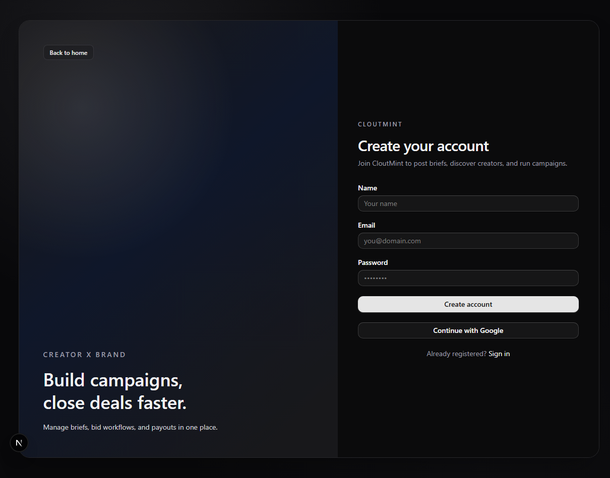

# CLOUTMINT

CLOUTMINT is a full-stack creator marketplace platform built with Next.js 16.  
This guide helps you get it running on your local machine quickly.

## Live demo

Currently live at - [cloutmint.curr.xyz](https://cloutmint.curr.xyz)

## Preview



## Features

- Role-based onboarding for Brands and Creators
- Secure authentication with Better Auth (email/password + social provider support)
- Brand flow to create/manage briefs and monitor creator bids
- Creator flow to explore open briefs and submit pitches
- Prisma-powered relational data model for users, briefs, bids, and projects
- Responsive dark UI built with Next.js App Router + Tailwind + shadcn-style components

## Local setup

### 1) Clone the project

```bash
git clone <your-repo-url>
cd cloutmint
```

### 2) Install dependencies

```bash
npm install
```

### 3) Configure environment variables

Create a `.env` file in the project root and add:

```bash
BETTER_AUTH_SECRET=your_32_plus_char_secret
BETTER_AUTH_URL=http://localhost:3000
GOOGLE_CLIENT_ID=your_google_client_id
GOOGLE_CLIENT_SECRET=your_google_client_secret
DATABASE_URL=your_postgres_connection_string
```

### 4) Setup database and Prisma client

```bash
npx prisma generate
npx prisma db push
```

For a fresh local reset:

```bash
npm run db:reset-local
```

### 5) Start the app

```bash
npm run dev
```

### 6) Open the app

- App: `http://localhost:3000`
- Auth route: `http://localhost:3000/api/auth/[...all]`
